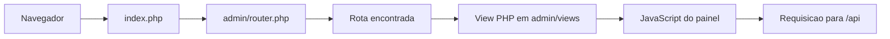
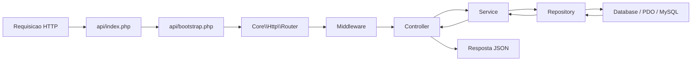

# Arquitetura do Sistema

## Visao geral

O projeto `LTD-C.T - Centro de Treinamento` e uma aplicacao web em PHP puro, executada em ambiente Apache/XAMPP, com separacao clara entre:

- painel administrativo em `admin/`;
- API HTTP em `api/`;
- assets estaticos em `public/`;
- scripts SQL e apoio tecnico em `docs/`.

O sistema foi estruturado para centralizar a gestao operacional de um centro de treinamento, mantendo a interface administrativa separada da regra de negocio e do acesso a dados.

## Estilo arquitetural

O estilo predominante do projeto e uma **arquitetura em camadas**, organizada principalmente como:

`Controller -> Service -> Repository -> Database`

Na pratica:

- `Controller` recebe a requisicao, extrai parametros, chama a regra de negocio e monta a resposta HTTP;
- `Service` concentra validacoes de negocio, coordenacao entre modulos e transacoes;
- `Repository` encapsula consultas SQL e persistencia;
- `DTO` transporta dados entre camadas com formato previsivel;
- `Database` fornece a conexao PDO compartilhada.

Esse desenho se aproxima de um **MVC orientado a servicos**, mas o projeto nao usa um framework MVC tradicional. Em vez disso, ele implementa seus proprios roteadores, controladores base e infraestrutura de validacao.

## Estrutura de diretorios

```text
ctt/
|-- admin/
|   |-- index.php
|   |-- router.php
|   |-- routes/
|   `-- views/
|-- api/
|   |-- bootstrap.php
|   |-- index.php
|   |-- core/
|   |   |-- Auth/
|   |   |-- DataTables/
|   |   |-- Database/
|   |   |-- DTO/
|   |   |-- Http/
|   |   |-- Services/
|   |   `-- Validation/
|   |-- routes/
|   `-- src/
|       |-- aluno/
|       |-- anamnese/
|       |-- auth/
|       |-- avaliacao/
|       |-- cargo/
|       |-- funcionario/
|       |-- local/
|       |-- modalidade/
|       |-- treino/
|       |-- turma/
|       `-- usuario/
|-- docs/
|   |-- arquitetura.md
|   `-- sql/
|-- public/
|   |-- css/
|   |-- img/
|   `-- js/
|-- index.php
`-- .htaccess
```

## Componentes principais

### 1. Painel administrativo

O painel administrativo fica em `admin/` e e responsavel pela navegacao de telas internas do sistema.

Responsabilidades:

- resolver rotas amigaveis para views PHP;
- aplicar middlewares simples baseados em sessao;
- carregar telas e parciais de interface;
- consumir a API via JavaScript no front-end.

Arquivos principais:

- `admin/index.php`: ponto de entrada do painel;
- `admin/router.php`: roteador de views do painel;
- `admin/routes/admin.php`: definicao central das rotas administrativas;
- `admin/views/`: telas e parciais.

### 2. API

A API fica em `api/` e concentra regra de negocio, autenticacao, validacao e acesso ao banco.

Responsabilidades:

- expor endpoints HTTP para o painel administrativo;
- validar e normalizar dados de entrada;
- executar regras de negocio;
- persistir e consultar dados no MySQL;
- responder em JSON.

Arquivos principais:

- `api/index.php`: entry point da API;
- `api/bootstrap.php`: configuracao inicial, autoload e despacho;
- `api/routes/api.php`: mapa central de endpoints;
- `api/core/`: infraestrutura compartilhada;
- `api/src/`: modulos por dominio.

### 3. Banco de dados

O banco e MySQL e a conexao e feita via PDO. Os scripts SQL ficam organizados em `docs/sql/setup/` (estrutura e dados iniciais), `docs/sql/migrations/` (alteracoes de bases existentes) e `docs/sql/testes/` (seeds e dados de teste).

Responsabilidades:

- armazenamento das entidades de negocio;
- suporte a relacionamentos como usuario, aluno, funcionario, turma, treino e anamnese;
- garantia de consistencia transacional nas operacoes mais importantes.

## Fluxo de requisicao

### Fluxo no painel administrativo



### Fluxo na API



## Organizacao por camada

### Controller

Os controllers fazem a borda HTTP do sistema.

Responsabilidades:

- ler `$_GET`, `$_POST` ou corpo JSON;
- montar DTOs;
- chamar services;
- transformar resultado em JSON;
- definir codigos HTTP e mensagens de erro.

Exemplos:

- `api/src/aluno/AlunoController.php`
- `api/src/turma/TurmaController.php`
- `api/src/auth/AuthController.php`

### Service

Os services implementam a regra de negocio e a coordenacao entre modulos.

Responsabilidades:

- validar regras de negocio;
- abrir transacoes;
- combinar operacoes de mais de um repository;
- reaproveitar servicos entre contextos diferentes.

Exemplos:

- `AlunoService` cria usuario e aluno dentro da mesma transacao;
- `TurmaService` coordena turmas, horarios e agenda;
- `AuthService` centraliza autenticacao.

### Repository

Os repositories encapsulam SQL e persistencia.

Responsabilidades:

- executar `SELECT`, `INSERT`, `UPDATE` e `DELETE`;
- isolar detalhes do schema;
- fornecer consultas especificas para cada modulo.

Exemplos:

- `AlunoRepository`
- `TurmaRepository`
- `UsuarioRepository`

### DTO

Os DTOs padronizam o transporte de dados entre controller, service e repository.

Responsabilidades:

- representar payloads com propriedades nomeadas;
- converter arrays em objetos;
- facilitar validacao e serializacao.

Exemplos:

- `AlunoDTO`
- `TreinoDTO`
- `FormularioDTO`

### Core

O diretorio `api/core/` concentra infraestrutura reutilizavel.

Subareas:

- `Http/`: controller base e router;
- `Database/`: conexao PDO e repositorio base;
- `Services/`: service base com suporte a transacao;
- `Validation/`: validador, excecoes e regras customizadas;
- `Auth/`: autenticacao e middleware;
- `DataTables/`: resposta padrao para listagens paginadas.

## Modulos de dominio

A pasta `api/src/` organiza o sistema por dominio de negocio. Cada modulo tende a agrupar classes relacionadas ao mesmo contexto.

Modulos identificados:

- `auth`: login, logout, recuperacao e redefinicao de senha;
- `usuario`: base de dados comum de usuarios;
- `aluno`: matricula, cadastro e relacionamento com turmas;
- `funcionario`: cadastro e controle de funcionarios;
- `cargo`: catalogo de cargos;
- `turma`: gerenciamento de turmas e presencas;
- `treino`: agenda e operacoes ligadas aos treinos;
- `local`: locais de treino;
- `modalidade`: modalidades esportivas;
- `anamnese`: formularios, perguntas, regras de exibicao e respostas;
- `avaliacao`: avaliacao fisica do aluno.

## Padroes de projeto presentes

O projeto nao gira em torno de um unico padrao GoF. Ele combina arquitetura em camadas com alguns padroes recorrentes.

### Repository

Cada modulo usa classes proprias para encapsular acesso ao banco.

Beneficio:

- reduz acoplamento entre regra de negocio e SQL.

### Singleton

A conexao de banco em `Core\Database\Database` e mantida em propriedade estatica e reutilizada em toda a aplicacao.

Beneficio:

- evita criar varias conexoes desnecessarias no mesmo ciclo de execucao.

### Front Controller

Tanto o painel quanto a API possuem pontos centrais de entrada que recebem a requisicao e a despacham para o destino correto.

Beneficio:

- padroniza inicializacao, carregamento de rotas e tratamento global da requisicao.

### Strategy

O sistema de validacao aceita regras intercambiaveis por meio de `ValidationRuleInterface` e callables.

Beneficio:

- permite adicionar validacoes especificas sem reescrever o validador base.

### DTO

Os DTOs organizam o transporte de dados entre camadas. Embora nao seja um padrao GoF, ele e central no projeto.

Beneficio:

- deixa o payload mais explicito e previsivel.

## Convenções do projeto

O projeto segue algumas convencoes importantes:

- separacao por dominio em `api/src/`;
- classes base em `api/core/`;
- respostas da API em JSON;
- painel administrativo consumindo a API por JavaScript;
- roteamento customizado, sem framework externo;
- uso de PDO com prepared statements;
- uso de sessao PHP para autenticacao do painel e da API.

## Exemplo de fluxo real

### Cadastro de aluno

Fluxo simplificado:

1. o front-end envia dados para `POST /alunos`;
2. `AlunoController` le o corpo da requisicao e monta `AlunoDTO`;
3. `AlunoService` valida regras e inicia transacao;
4. `UsuarioService` cria a base de usuario;
5. `AlunoRepository` grava os dados especificos do aluno;
6. o controller devolve JSON com sucesso ou erro.
